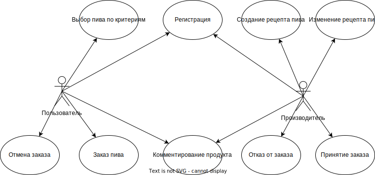

# PPO

## 1. Название проекта

Deus cervisie

## 2. Краткое описание идеи проекта

Сервис подбора пива по индивидулаьным требованиям. Пользователю будут рекомендоваться марки пива, соотвествующие его требованиям и производители, занимающиеся данными марками. Производители будут получать обратную связь и собирать статистику популярности определенных марок в целом и ингридтентов в частности.

## 3. Краткое описание предметной области

Торговые отношения между покупателями и местными производителями крафтового пива.

## 4. Краткий анализ аналогичных решений по 3 критериям

|Решение|Платформа|Виды товаров|Фильтрация товаров|
|---|---|---|---|
|Мое|Desktop|крафтовое пиво|По параметрам/по ингридиентам|
|Wildberries|Web/Desktop/Mobile|Прикладные товары|По параметрам товара|
|Delivery Club|Web/Mobile|Еда|Виды пищи|

## 5. Краткое обоснование целесообразности и актуальности проекта

В настоящее время индустрия крафтового пива является развивающейся областью пищевой индустрии и в большинстве своем основано на импорте. Производители не имеют обратной связи с покупателями: таким образом развитие данной области замедляется. Основная же масса потенциальных потребителей не упускает возможность приобщиться из-за ряда препядствий: малоизвестности понятия, редкости точек продажи, высокой цены из-за импорта. Все эти проблемы можно устранить.

## 6. Use-Case - диаграмма

## 7. ER-диаграмма сущностей 

## 8. Пользовательские сценарии

## 9. Формализация бизнес-правил (в виде BPMN)

